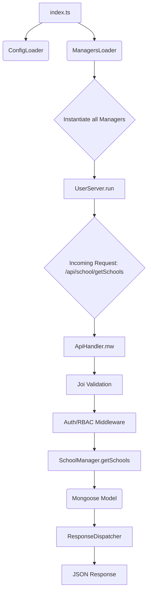

# School Management System API

A RESTful API service for school management.

## Tech Stack
- **Node.js** & **TypeScript**
- **Express.js** (Web Framework)
- **MongoDB** with **Mongoose** (Database)
- **JWT** (Authentication)
- **Swagger** (API Documentation)
- **Vercel** (Deployment)

## Features
- **Role-Based Access Control (RBAC)**:
  - `SUPERADMIN`: Full system access. Pre-seeded for testing.
  - `SCHOOL_ADMIN`: Access limited to their assigned school. Created by SuperAdmin.
  - `STUDENT`: Access to their own data. Created by admins during enrollment.
- **School Management**: Full CRUD for schools.
- **Classroom Management**: Manage classrooms within a school.
- **Student Management**: Enrollment, transfers, and profile management.
- **Security**: Rate limiting, Helmet, and input validation.

## Setup Instructions

### Prerequisites
- Node.js (v18+)
- MongoDB (Local or Atlas)

### Installation
1. Clone the repository.
2. Navigate to `soar_assesment` directory.
3. Install dependencies:
   ```bash
   npm install
   ```
4. Create a `.env` file based on `.env.example` and fill in your details.

### Running Locally
- Development mode (with nodemon):
  ```bash
   npm run dev
   ```
- Build and run:
  ```bash
   npm run build
   npm start
   ```

## User Roles & Credentials (For Testing)

For testing purpose, the system automatically seeds a SuperAdmin on startup. This will be done once. On Prod, this will be done on CLI.

### 1. SuperAdmin
- **Email**: `owolabihammed3600@gmail.com`
- **Password**: `Password@442`
- **Capabilities**: Can create any user (using `POST /api/auth/createUser`) and manage all schools.

### 2. Automated Password Generation
When a `SUPERADMIN` creates a `SCHOOL_ADMIN`, or an admin enrolls a `STUDENT`, the password is automatically generated as:
`password = (firstName + lastName).toLowerCase()`, however, the password can be changed by the user later.

**Example**:
- firstName: `John`, lastName: `Doe`
- Generated Password: `johndoe`

## API Documentation
Once the server is running, documentation is available at:
`http://localhost:3000/api-docs`

## Architectural Pattern

The system follows a **Manager-based RPC (Remote Procedure Call)** architecture, where business logic is decoupled from the transport layer (Express).

### System Flow Diagram


### Components
- **Managers**: Encapsulate pure business logic. They are "transport agnostic" and can be triggered by HTTP, CLI, or other internal modules.
- **Loaders**: Centralized dependency injection (DI) container that initializes and wires all managers together.
- **ApiHandler**: A dynamic dispatcher that serves as the single gateway for all API calls, handling routing, validation, and authentication.
- **Validation Layer**: Uses **Joi** to sanitize and validate request payloads before they reach the managers.
- **ResponseDispatcher**: Standardizes all API outputs, ensuring consistent status codes and error formats.
